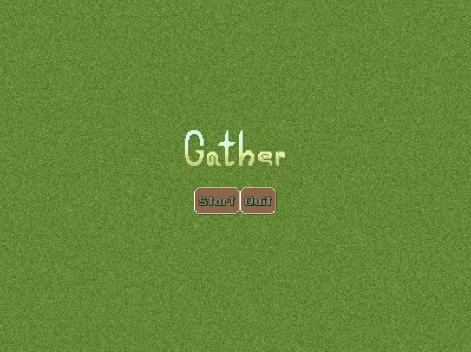
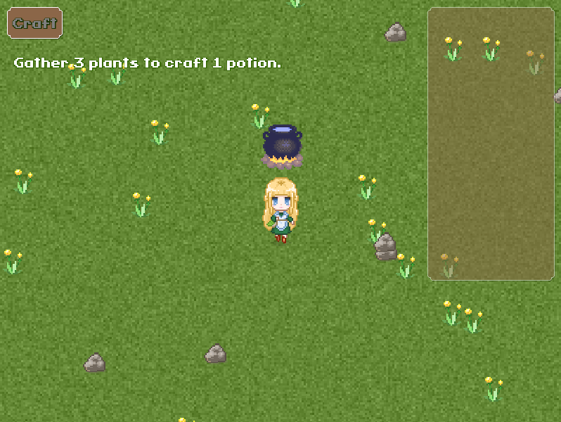
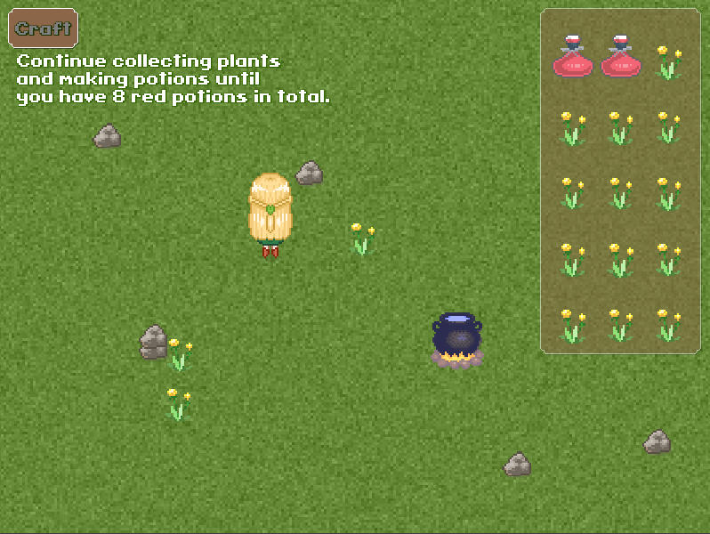

# Gather
A 2D potion making game using libGDX

## about
## [Download playable .jar] https://github.com/kellyegammons/Gather/raw/master/gather-alpha-v0.01.jar
(you must have JRE installed)

The objective is to create 8 potions by collecting plants and crafting. 
This game was built with libGDX and with guidance from the book 
Java Game Development with LibGDX by Lee Stemkoski.
The font used is Cave Story and the pixel artwork is created by me.

